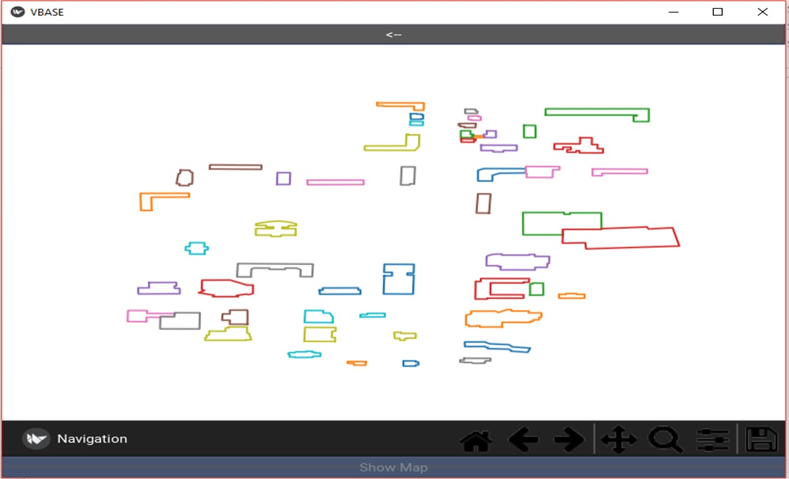
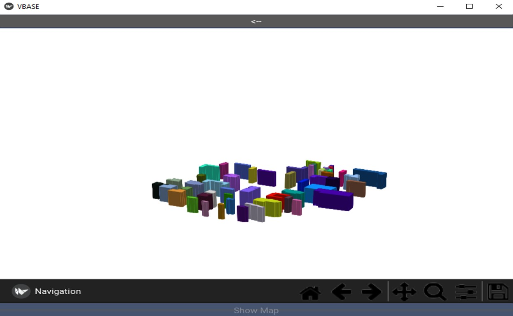

# GIS-Visual-Database
/********* IN PROGRESS ********/

Abstract:

For the scope of this project, the development of a visual GIS database with a User Interface is a realistic goal. This software will allow users to essentially upload .shp, and .dbf files to a database while also being able to visualize such data in 2D and 3D (VR for future development). 

Language: Python

Libraries: Kivy, Kivy Garden, sqlite3, matplotlib, numpy, shutil, os

